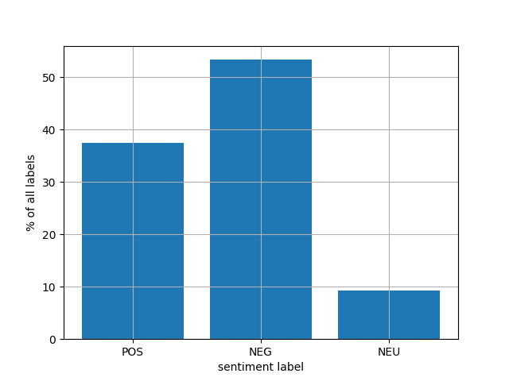
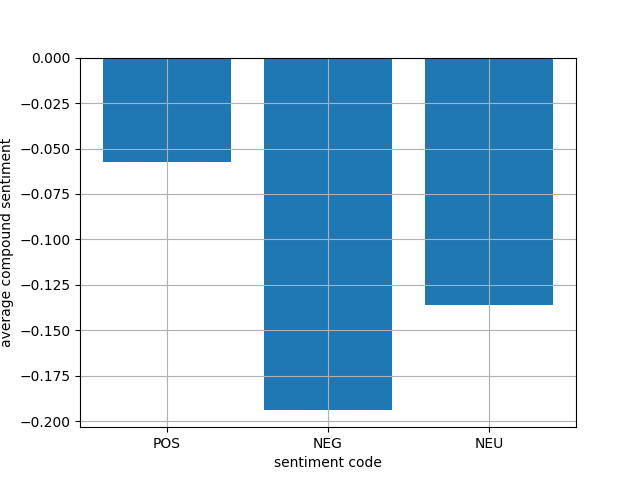
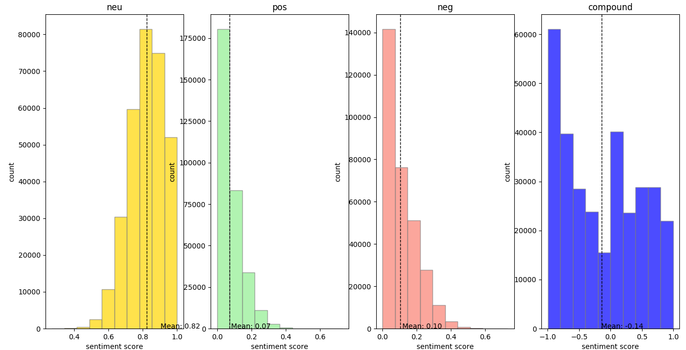

# Testing controllable abstractive summarization model on sentiment

Before proceeding with the reinforcement learning experiment, first a test of the conditional supervised learning system with a sentiment control has been conducted. Specifically, the architecture developed by Fan et al., that originally was conditioned on length, source style and entities, was extended to include sentiment as a control feature. 

To test this, sentiment of every summary has been inferred with a rule-based sentiment analyzer VADER available in the NLTK package for Python. The sentiment score consists of four rubrics: positive, negative and neutral valence and a compound score. The former three count the ratio of words with certain valence, while taking into account accentuations (e.g. "good" vs. "very good") and negations (e.g. "not good"). The latter, compound score, is a composite of the positive, negative and neutral valence; however, neutral words do not contribute to the compound score as their valence is assigned 0. According to the documentation of VADER, compound score *s > 0.05* corresponds to positive sentiment, compound score *s < 0.05* to negative sentiment and values in between to neutral sentiment. Hence, all summaries in the dataset were classified as positive, negative or neutral according to this rule. This results in the following distribution: 

  

As can be observed here, the distribution is not uniform, in constrast with the distribution of length codes in the previous experiment. Moreover, neutral sentiment class is underrepresented in the distribution compared to the other two. While it might be problematic for the model to pick up on the neutral sentiment control, there is a comparable ratio of positive and negative classes in the dataset, which should allow the model to learn. 

### Performance on test set
In fashion similar to other control features in the controllable abstractive summarization experiment, we prepend a sentiment class to all inputs (i.e. news stories) that are fed to the seq2seq model. The model, identical to the baseline from previous experiments, was trained for 30 epochs on an updated version of the dataset, cleaned from special unicode characters. 

The observed results of the model without any controls, indicating the general performance at the task of summarization, are lower than both in the original paper and in the previous experiments that excluded sentiment control. Namely, we observe the following scores:
* ROUGE-1: 31.69 (32.58, values in brackets are the metrics from the experiment excluding sentiment control)
* ROUGE-2: 9.12 (15.03)
* ROUGE-L: 27.72 (34.49).

However, in contrast to experiments on length control, the inclusion of native controls leads to improved performance. To reiterate,  native indicates the sentiment class of the ground-truth summary:
* ROUGE-1: 31.73 (32.01)
* ROUGE-2: 9.18 (9.45)
* ROUGE-L: 27.82 (28.67).

While the performance for specific sentiment codes varies, the differences are small and not comparable to differences in ROUGE observed on length control. However, this might have to do with the fact that sentiment control itself has not been sufficiently achieved. 

### Sentiment control performance
To confirm whether the model achieves sentiment control, every sample in the test set is passed to the model three times, once per every sentiment class. The sentiments of the generated summaries are then averaged per category, and are shown in the following bar chart. 

  

While it indeed holds that the highest compound sentiment is observed for positive control code and the lowest is for negative code, the actual magnitude of the score is very limited. Moreover, for all sentiment categories the compound score is negative, and according to the VADER methodology, every observed score corresponds to the negative sentiment. 

Perhaps, this has to do both with the complexity of sentiment control and the narrow distribution of valence in the dataset. Note, that this is different from the distribution of sentiment labels in data; the narrow distribution of valence refers to the observation that the overwhelming majority of summaries is observed with an abundance of neutrally valent and shortage of positively and negatively valent words, suggesting that sentiment is an "out-of-domain" feature of control. 

  

This observation confirms our hypothesis that supervised conditional learning is not a suitable framework for enforcing sentiment over the abstractive summarization task, specifically on the CNN/Daily Mail dataset. Tt remains unclear whether this is due to the out-of-domain nature of sentiment in this dataset, or with the complexity of sentiment control that needs specific mechanisms in the training pipeline to be successfully enforced. Nevertheless, this suggests that it is worthy to proceed with the reinforced controllable summarization model, specifically with sentiment control.