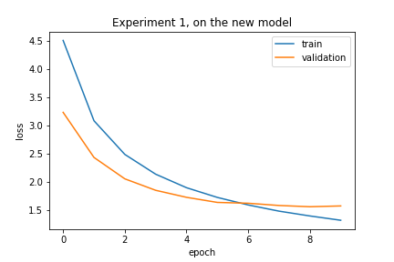
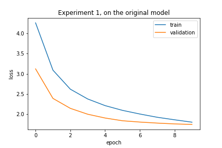
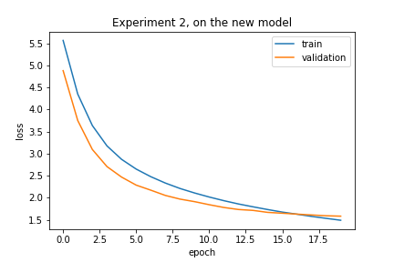

To clarify, *original model* is the one provided in the NMT experiment. *New model* is the implementation of Fan et al, 2017. 

# Experiment 1. Identical setups on NMT
The new model was adjusted to match the original model, so both models were trained with the same architecture and optimizer on the task of neural machine translation from German to English: 
* CNN-based encoder and decoder
* 8 layers each in encoder and decoder
* Encoder and decoder connected through attention
* No self-attention
* Emb dim: 256, Hid dim: 512
* Total number of parameters in *original* model: 37,351,685
* Total number of parameters in *new* model: 37,351,685
* Adam optimizer, standard learning rate

The dataset used for this experiment was Multi30K, consisting of pairs of parallel sentences in English and German. Dataset statistics are as follows: 

* Train set: 29000, validation set: 1014, test set: 1000
* Vocab size, German (=input dim): 7855
* Vocab size, English (=output dim): 5893
* **German**:
* * Mean sentence length (in tokens): 12.439689655172414
* * Minimum length: 1
* * Maximum length: 44
* **English**:
* * Mean sentence length (in tokens): 13.109862068965517
* * Minimum length: 4
* * Maximum length: 41

Both models were trained for 10 epochs, and the model with best performance on validation set was saved. Performance of best model on the test set:
* Original: | Test Loss: 1.862 | Test PPL:   6.437 |
* New: | Test Loss: 1.637 | Test PPL:   5.139 |

Some sample responses, as produced by the two models (without teacher forcing):  
* Ground truth: ['a', 'little', 'girl', 'climbing', 'into', 'a', 'wooden', 'playhouse', '.']
* * Original model inference: ['a', 'little', 'girl', 'climbing', 'in', 'a', 'playhouse', 'out', 'wood', '.', '<eos>']
* * New model inference: ['a', 'little', 'girl', 'climbing', 'into', 'a', 'wooden', 'playhouse', '.', '<eos>']
* Ground truth: ['two', 'men', 'are', 'at', 'the', 'stove', 'preparing', 'food', '.']
* * Original model inference: ['two', 'men', 'stand', 'on', 'the', 'stove', 'preparing', 'food', 'and', 'preparing', 'food', '.', '<eos>']
* * New model inference: ['two', 'men', 'are', 'standing', 'on', 'the', 'stove', 'preparing', 'food', '.', '<eos>']

# Experiment 2. Text summarization architecture tested on NMT
For this experiment, the task remains the same: translation from German to English. However, this time the implementation used for the controllable abstractive summarization task is compared with the original NMT model. Therefore, the model architecture for *original* remains the same as in experiment 1, but the model achitecture *new* as adjusted with the following modifications:
* Number of layers reduced from 10 to 8
* Self-attention added
* Embedding dimension increased from 256 to 340
* SGD optimizer used with learning rate 0.2 decreased when validation loss stops decreasing

While the original implementation by Fan et. al, 2017, had a separate attention and self-attention mechanism for every convolutional layer, for this experiment only one of each was kept due to the relatively small size of the training dataset. Moreover, since the model relies on learning rate reduction, it was trained for 20 rather than 10 epochs.

### Initial failure
After initial run of the experiment, it was observed that the new model is underperforming: while the loss was decreasing and the sequences predicted with teacher forcing were close to perfect, actual inference without teacher forcing led to close to random results. Since the main difference between the setup of the new model in the 1st and 2nd experiments was in the self-attention layer, it was decided to investigate this module. 

### Lacking masks for future time-steps
As pointed out in this [tutorial](https://pytorch.org/tutorials/beginner/transformer_tutorial.html), the future time-steps from the decoder have to be masked when using teacher-forcing. Otherwise, the model cah "cheat" by looking up the needed targets. Therefore, the self-attention module in the implementation was adjusted to include this modification; afterwards, the experimental results suggested satisfactory performance. 

### Debugged experimental results

* | Test Loss: 1.656 | Test PPL:   5.240 |
* Ground truth: ['a', 'man', 'in', 'an', 'orange', 'hat', 'starring', 'at', 'something', '.']
* * New model inference: ['a', 'man', 'in', 'an', 'orange', 'hat', 'is', '<unk>', 'something', '.', '<eos>']
* Ground truth: ['a', 'boston', 'terrier', 'is', 'running', 'on', 'lush', 'green', 'grass', 'in', 'front', 'of', 'a', 'white', 'fence', '.']
* * New model inference: ['a', 'football', 'runner', 'is', 'running', 'across', 'grass', 'grass', 'in', 'front', 'of', 'a', 'white', 'fence', '.', '<eos>']
* Ground truth: ['a', 'girl', 'in', 'karate', 'uniform', 'breaking', 'a', 'stick', 'with', 'a', 'front', 'kick', '.']
* * New model inference: ['a', 'girl', 'in', 'a', 'karate', 'uniform', 'is', 'flipping', 'a', 'board', 'with', 'a', 'kick', '.', '<eos>']