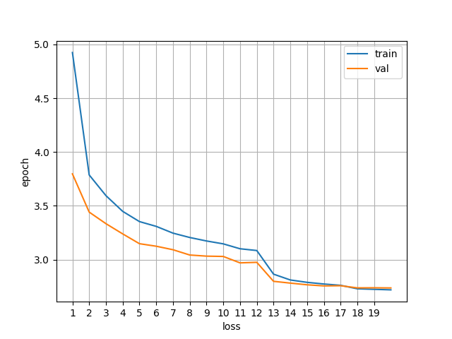
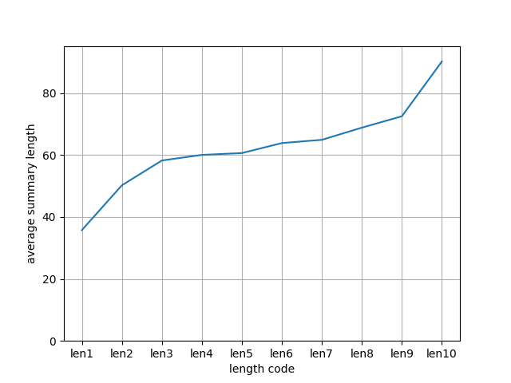

# Training the model
The trained model is closely following the implementation by Fan et al., 2017. Namely, the model and the training pipeline are as follows:
* CNN-based encoder and decoder, kernel size 1x3
* 8 layers each in encoder and decoder
* Vocab-embed layers shared between encoder and decoder (*"we share representation of tokens in encoder and decoder embeddings"*, Fan et. al, 2017)
* Hid-emb final layer shared between encoder and decoder (*"we share representation of tokens ... in last decoder layer"*, Fan et. al, 2017)
* Encoder and decoder connected through (inter-)attention
* Self-attention in decoder
* Attention layers in decoder alternate between self-attention and inter-attention at every layer
* Emb dim: 340, Hid dim: 512
* Total number of parameters in the model: 43,464,427
* Byte-pair-encoding of text for reducing vocab size
* Adam optimizer, starting learning rate 0.2
* Decaying learning rate; decrease by magnitude 10 if val loss not decreasing
* Stop training if learning rate <2e-4

The dataset used for the experiments is CNN / Daily Mail, consisting of pairs of input news stories and output summaries. Dataset statistics are as follows: 

* Train set: 287741, validation set: 10,923, test set: 13,420
* Vocab size under BPE (=output dim): 19,423
* **Stories**:
* * Maximum length: 6078
* **Summaries**:
* * Mean sentence length (in BPE tokens): 59.88
* * Maximum length: 681

To achieve the finishing condition (val loss < 2e-4), it took 21 epochs and approximately 48 hours of training. The train and model losses in the figure below. The ROUGE score on the validation set by the end of training is ROUGE-1: 0.6780, ROUGE-2: 0.2849, ROUGE-L: 0.6538; those are obtained with teacher forcing and therefore are not representative of the models independent inference ability. 

  

# Testing without teacher forcing and enforcing length control
To evaluate the inference capacity of the trained model, we run inference on the test set without teacher forcing, i.e. the model does not have access to ground truth at inference time. We also test the capacity of the model at enforcing length control.

More specifically, during training the model was exposed to one out of 10 length control codes, *lenX*, with values of X from 1 to 10. Each code indicates how long the ground truth summary is, where *len1* corresponds to shortest and *len10* corresponds to longest category. In this way, the model is exposed to the length codes during training and hopefully learns to generalize and adjust the inferred summaries based on any length code. 

Testing the model without teacher forcing and any control codes, therefore omitting the *lenX* feature, leads to the following performance: 
* ROUGE-1: 0.3535
* ROUGE-2: 0.1143
* ROUGE-L: 0.3286

Including the *native* length code, however, leads to decreased ROUGE performance. Here, native indicates the length code of the ground-truth summary, even though the model does not have access to the text itself at inference time. The following is the performance:
* ROUGE-1: 0.3112
* ROUGE-2: 0.0964
* ROUGE-L: 0.2880

Finally, to test if the model succeeds at enforcing control over length, every summary in the test set was passed through the model 10 times, once for every different length code. Having done this on all samples, we obtain the average summary length as well as ROUGE performance per length category. The following plot shows that the model indeed learns to write shorter or longer summaries based on the length control code:

  

As for the ROUGE evaluation, the best performance is achieved with *len10* control code. This comes both as a surprise and not. It is surprising to see that a single discrete feature can boost the performance; however, it is also obvious that it might boost the ROUGE metric, since calculates recall rather than precision between the generated summary and ground truth. Therefore, as the model makes longer predictions, it has a higher chance of including text that is also present in the target. 
* ROUGE-1: 0.3729
* ROUGE-2: 0.1224
* ROUGE-L: 0.3465

Some sample responses, on smallest and largest length code, as produced on the test set without teacher forcing:  
* **Ground truth:** Damning 400 page report says @entity2 profited ' unethically ' from public funds. The report also mentions that he did this by accident. The extensions to his compound included a ' fire pool ' and a helipad. Many neighbors were moved out of the area to make way for extensions. @entity3 president @entity2 must now pay the money back
* **Length category *len1*:**  @entity3 president @entity2 was booing a sponalion at his private residence in december. The 71 year old leader was booed with thousands at memorial service for the 71-year-old president. He must repay part and will repay the costs the 400 pages
* **Length category *len10*:**  @entity3 government ordered 400 pages of a $20million refurbishment. @entity3 government says the 'inferonability' is 'unconscionable and excessive misappropriation of public funds'. The report has sparked massive resentment and has been ordered to rerepay part. The 71 years old president was booed spontaneously by thousands of mourners at a memorial service for @entity26 , last december.
